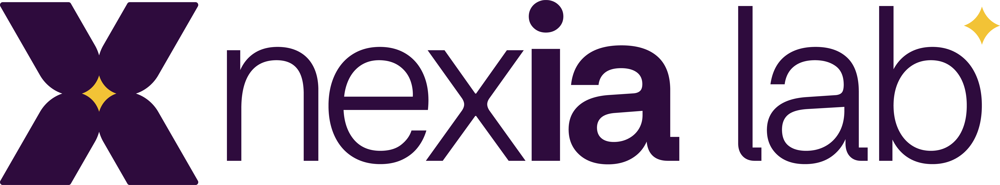

<p align="center">
  
</p>

<h1 align="center">contract-rules</h1>

<p align="center">
  Skill para Claude Code que transforma contratos em regras estruturadas<br/>
  para agentes de IA em centrais de atendimento ITIL.
</p>

<p align="center">
  <a href="https://contract-rules.vercel.app"><strong>Live Demo</strong></a> &nbsp;|&nbsp;
  <a href="#como-usar--extrair-regras-de-um-contrato">Uso</a> &nbsp;|&nbsp;
  <a href="#estrutura-dos-arquivos">Estrutura</a> &nbsp;|&nbsp;
  <a href="#testes">Testes</a>
</p>

---

## O que faz

Leia um contrato ou documento de regras de negocio, extraia automaticamente via Claude API e gere um schema estruturado (`rules_schema.md`) que agentes de IA consultam para responder clientes com precisao — citando o ID da regra, aplicando prioridade (alta/media/baixa) e escalando quando nao ha cobertura.

Segue o padrao Agent Skills (`SKILL.md`) compativel com Claude Code, Cursor, Windsurf e outros.

## Stack

| Camada | Tecnologia |
|--------|-----------|
| Skill | `SKILL.md` (Claude Code / Cursor / Windsurf) |
| Extrator | Python 3.9+ + Anthropic API (Claude Sonnet) |
| Backend | FastAPI (8 endpoints) |
| Frontend | React 18 + Vite + Tailwind CSS |
| Testes | pytest (17) + vitest (14) |
| Deploy | Vercel (serverless) |

## Instalacao

```bash
# Clonar
git clone https://github.com/anaperci/contract-rules.git
cd contract-rules

# Ou copiar direto para o Claude Code
cp -r contract-rules ~/.claude/skills/

# Deps
pip install anthropic
cd frontend && npm install
```

## Como usar — extrair regras de um contrato

```bash
# Basico
python scripts/extract_rules.py --input meu_contrato.txt

# Com opcoes
python scripts/extract_rules.py \
  --input contrato_sla.txt \
  --company "NexIA Lab" \
  --type suporte

# Ver ajuda
python scripts/extract_rules.py --help
```

## Como usar — no Claude Code

```
# O Claude carrega automaticamente quando detecta perguntas
# sobre politicas, reembolsos, SLA ou regras contratuais

# Invocacao manual
/contract-rules
```

## Como usar — interface web

```bash
# Terminal 1 — API (porta 8899)
python api/server.py

# Terminal 2 — Frontend (porta 5173)
cd frontend && npm run dev
```

5 telas: **Dashboard** | **Extrair Regras** | **Regras** (filtros + edicao inline) | **Testar** (chat simulado) | **Historico**

**Producao:** https://contract-rules.vercel.app

## Testes

```bash
# Backend (pytest)
pytest -v
# 17 passed

# Frontend (vitest)
cd frontend && npm test
# 14 passed
```

| Suite | Runner | Testes | Cobertura |
|-------|--------|--------|-----------|
| API Health | pytest | 4 | health, stats, empty state |
| Rules CRUD | pytest | 7 | parse, filtros, update, 404 |
| Extraction | pytest | 3 | validacao, API key, empty |
| CLI Script | pytest | 3 | --help, file missing, env |
| API Service | vitest | 7 | todas as funcoes + erros |
| Pages | vitest | 7 | 5 paginas + sidebar |

## Estrutura dos arquivos

```
contract-rules/
├── SKILL.md                        # Skill definition (Claude Code)
├── api/
│   ├── server.py                   # FastAPI (8 endpoints)
│   └── index.py                    # Vercel serverless entrypoint
├── scripts/
│   └── extract_rules.py            # CLI extrator via Claude API
├── references/
│   ├── rules_schema.md             # Regras extraidas (auto-gerado)
│   ├── priority_guide.md           # Guia alta/media/baixa
│   └── response_examples.md        # 5 exemplos de respostas
├── assets/
│   ├── nexia-logo.png              # Logo NexIA Lab
│   └── skill_template.md           # Template para skills derivadas
├── frontend/                       # React + Vite + Tailwind
│   └── src/
│       ├── components/             # Sidebar (#1F4067), RuleCard, StatCard
│       ├── pages/                  # Dashboard, Extract, Rules, Test, History
│       ├── services/api.js         # API client
│       └── test/                   # vitest (14 tests)
├── tests/                          # pytest (17 tests)
├── vercel.json                     # Deploy config
├── requirements.txt                # Python deps
└── README.md
```

| Arquivo | Funcao |
|---------|--------|
| `SKILL.md` | Instrucoes que o Claude carrega automaticamente. Define comportamento, fluxo de decisao e gatilhos de escalacao. |
| `scripts/extract_rules.py` | Le um contrato, chama a API do Claude para extrair regras estruturadas e salva em `rules_schema.md`. |
| `references/rules_schema.md` | Arquivo auto-gerado com todas as regras extraidas. Consultado pelo agente em cada interacao. |
| `references/priority_guide.md` | Guia para revisao manual de prioridades (alta/media/baixa). |
| `references/response_examples.md` | 5 exemplos completos de pergunta/resposta aplicando regras. |
| `assets/skill_template.md` | Template para criar skills derivadas para outros contratos. |

## Variaveis de ambiente

```bash
export ANTHROPIC_API_KEY=sk-ant-...
```

## Compatibilidade

| Ferramenta | Suporte |
|------------|---------|
| Claude Code | `SKILL.md` carregado automaticamente |
| Cursor | Copiar conteudo para `.cursorrules` ou `.mdc` |
| Windsurf | Copiar conteudo para `.windsurfrules` |
| Codex CLI | Referenciar `SKILL.md` no prompt |
| Gemini CLI | Referenciar `SKILL.md` no prompt |

## Licenca

MIT

---

<p align="center">
  <sub>Desenvolvido por <strong>NexIA Lab</strong> + <strong>NCT Informatica</strong></sub>
</p>
